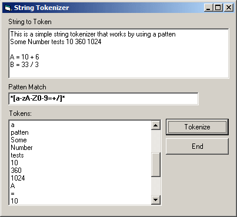



## String Tokenizer

### Description

This is a very small String tokenizer class, that can tokenize a string based on a patten, usfull for evalulators of anything else, anyway hope you like it.
 
### More Info
 

             |
---                |---
**Submitted On**   |2009-02-04 16:00:02
**By**             |[dreamvb](https://github.com/Planet-Source-Code/PSCIndex/blob/master/ByAuthor/dreamvb.md)
**Level**          |Beginner
**User Rating**    |4.7 (14 globes from 3 users)
**Compatibility**  |VB 6\.0
**Category**       |[String Manipulation](https://github.com/Planet-Source-Code/PSCIndex/blob/master/ByCategory/string-manipulation__1-5.md)
**World**          |[Visual Basic](https://github.com/Planet-Source-Code/PSCIndex/blob/master/ByWorld/visual-basic.md)
**Archive File**   |[String\_Tok214265242009\.zip](https://github.com/Planet-Source-Code/dreamvb-string-tokenizer__1-71721/archive/master.zip)

